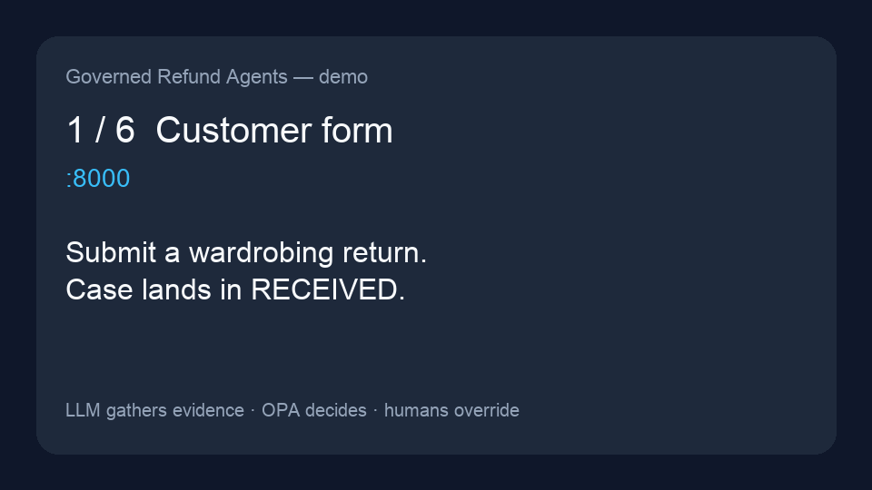
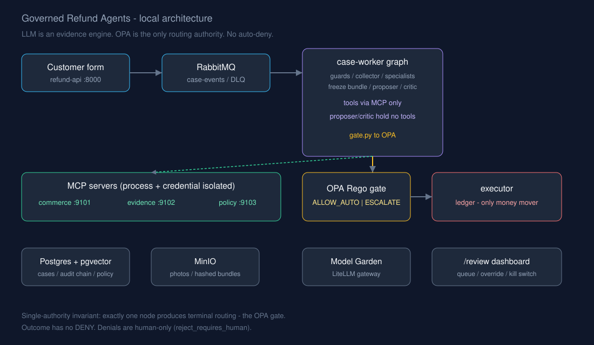

# Governed Refund Agents

**Local-first capstone:** multi-agent e-commerce return adjudication where
**the LLM is an evidence engine, not a decision authority.**

Deterministic OPA Rego is the only node that can route a case to payout or a
human. Agents gather evidence through least-privilege MCP tools, freeze a
hashed bundle, propose and cross-critique — then the gate decides. There is
**no auto-deny**; denials are human-only.

Full build record: [`PLANNING-LOCAL.md`](PLANNING-LOCAL.md) · session handoff:
[`RESUME.md`](RESUME.md) · cloud path (not built): [`PLANNING.md`](PLANNING.md)



## Quick start

```bash
colima start --foreground   # if Docker isn't up; plain `colima start` can die on this machine
make up && make migrate && make seed
make verify                 # L0–L8 checks + Rego tests
```

Then open:

| Surface | URL |
|---|---|
| Customer form / status | http://127.0.0.1:8000/ |
| Reviewer dashboard | http://127.0.0.1:8000/review |
| RabbitMQ | http://127.0.0.1:15672/ |
| MinIO | http://127.0.0.1:9201/ |
| OPA | http://127.0.0.1:8281/ |
| mock-commerce | http://127.0.0.1:8010/docs |

Reviewer / admin passwords live in `.env` (`REVIEWER_PW`, `ADMIN_PW`). Gateway key:
`LITELLM_API_KEY`. Never commit them.

Out of the box **every segment is at `shadow`** — every case escalates until you promote
a segment (SQL in *What L5 proves* in `PLANNING-LOCAL.md`).

## Architecture



```mermaid
flowchart LR
  Form[Customer form] --> API[refund-api]
  API --> RQ[RabbitMQ case-events]
  RQ --> CW[case-worker graph]
  CW --> MCP[MCP commerce / evidence / policy]
  CW --> Gate[OPA Rego gate]
  Gate -->|ALLOW_AUTO| Ex[executor + ledger]
  Gate -->|ESCALATE| Rev[/review dashboard]
  CW --> MinIO[(MinIO hashed bundles)]
  CW --> PG[(Postgres audit chain)]
```

**Invariants enforced by types and schema, not prose:**

- `Outcome` has no `DENY`
- an `APPROVE` with empty `evidence_refs` cannot be constructed
- `EvidenceBundle` recomputes its own hash on construction
- DB constraint `reject_requires_human` on `decisions`
- proposer / critic import no tools (`verify_l4.py`)

## Metrics

From the live eval harness (`make replay` / `make replay-report`). Source of truth:
[`infra/local/replay/report.md`](infra/local/replay/report.md). Corpus = first 25 labelled
cases per pattern (200 total); gate scored **as if at `auto`**.

| Metric | Value (partial corpus) |
|---|---|
| Measured | **73 of 200** (1 unmeasurable excluded) |
| **False approves** | **0** |
| False escalations | 18/25 (72%) of labelled `AUTO_APPROVE` |
| Gate agreement with label | 55/73 (75%) |
| Agent (shadow) agreement | 71/73 (97%) |
| Latency | p50 **18 s**, p95 **87 s** |

| Pattern | n | Gate allowed | Top binding rule |
|---|---|---|---|
| `account_takeover` | 25 | 0/25 | `agent_recommends_review` |
| `clean_legitimate` | 25 | 7/25 | `critic_dissent` |
| `empty_box` | 23 | 0/23 | `agent_recommends_review` |

Re-run `make replay` to finish the remaining patterns. Exit **1** on any false approve;
exit **3** until the corpus is fully measured.

Capability probe evidence (L0.5): [`infra/local/capability-report.json`](infra/local/capability-report.json)
— **P1 native tool-calling PASS**, **P6 embedding dim 1024 PASS**. Vision is blind (P3);
Prompt Guard is not deployed (injection screen is a pattern fallback).

## Demo script

Six-tab walkthrough (storyboard GIF above; full script in [`docs/demo.md`](docs/demo.md)):

1. **Customer form** (`:8000`) — submit a wardrobing return
2. **RabbitMQ** (`:15672`) — message on `case-events`
3. **MinIO** (`:9201`) — frozen `bundles/{case}/{hash}.json`
4. **Reviewer dashboard** (`:8000/review`) — binding rule, critic, evidence
5. **OPA** (`:8281`) — paste `GateInput` → `ESCALATE` + `rule_id`
6. **MCP access log** (psql) — every tool call the server recorded (INSERT-only role)

Then flip the **kill switch** as admin and show payouts stop.

**Langfuse not built / not required** — declined at L8; `/review` already shows the
node timings, gate input, and models a trace would add for a reviewer.

Regenerate the storyboard: `uv run --with pillow scripts/make_demo_gif.py`

## Verify

```bash
make verify          # L0 … L8
make verify-chain    # audit hash chain
make replay-report   # metrics without LLM calls
opa test             # via make verify (inside the OPA container)
```

## Stack (local Docker)

Postgres + pgvector · RabbitMQ · MinIO · OPA · mock-commerce · refund-api · case-worker ·
executor · three MCP servers · GoTo Model Garden (LiteLLM) for models.

Milestones **L0 → L8** are complete. Optional **L9** is the cloud substrate in `PLANNING.md`.
